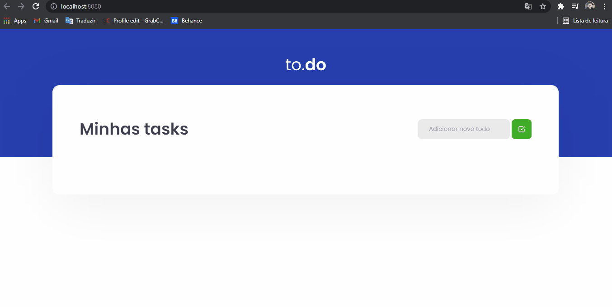

<h1 align="center">
  
</h1>

<h3 align="justify">
To.do is an academic demonstration of a personal calendar web application made with JavaScript, ReactJS, TipeScript, and SASS. Credits for Chapter 1 module of the ReactJS track - Ignite from rocketseat.
</h3>

 

## 📷 Demonstration

  

 

## 🚀 Technologies

This project was developed with the following technologies:

- JavaScript
- ReactJS
- TipeScript
- SASS

 

## ⚙ Settings
- yarn init -y (package.json)
- yarn add react (node_modules)
- yarn add react-dom
- yarn add @babel/core @babel/cli @babel/preset-env -D
- yarn add @babel/preset-react -D
- yarn babel src/index.js --out-file dist/bundle.js
- yarn babel src/index.jsx --out-file dist/bundle.js
- yarn add webpack webpack-cli -D
- yarn add babel-loader -D
- yarn webpack
- yarn add html-webpack-plugin -D (HTML estatic)
- yarn add webpack-dev-server -D (library dinamic webpack)
- yarn webpack serve (dinamic webpack)
- yarn add cross-env -D
- yarn dev (development environment)
- yarn build (production environment)
- yarn add style-loader css-loader -D (importing css)
- yarn add sass-loader -D
- yarn add node-sass -D
 

---

Made with 💜 by Rafael Maciel
